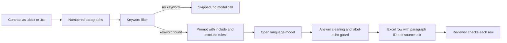
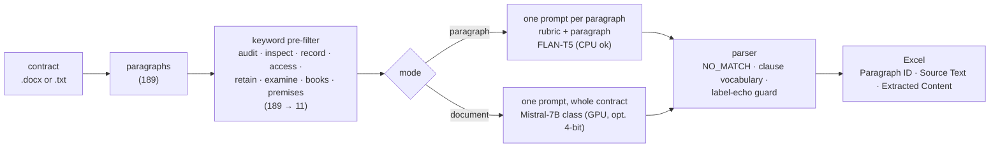

# Contract Clause Extraction: Audit & Inspection Rights

**Pull every "Audit & Inspection Rights" clause out of a contract with an open LLM, straight into Excel, with each hit traced back to its source paragraph. Measured on a public SEC-filed contract on a laptop CPU: 8 of 8 clauses found, 1 false positive.**

  [](https://github.com/gandhiashutosh14/contract-clause-extraction/actions/workflows/ci.yml) 

---

> **In plain English:** Legal, procurement and compliance teams must find specific obligations, such as one company's right to audit another's records, across many contracts. This tool uses an open language model to pull those clauses into Excel, and each row names its source paragraph for review. It is a tested working prototype, measured on one public contract.
>
> **Reading guide:** business readers can read the next three sections, then jump to [SWOT](#swot-analysis) and [where this applies](#where-this-applies). Engineers can go straight to [How it works](#how-it-works).

## The problem in plain English

A company has signed many supplier and partner contracts. Its internal auditor asks two questions: in which contracts may we inspect the other side's books, and how long must records be kept? Today someone opens each contract and reads it. In the public sample contract used here, the answers sit in Articles 9 and 10, among 189 paragraphs ([measured results](#measured-results)).

Large language models (LLMs) read quickly, but they bring two risks. They can return text that sounds right but is not a match, such as a clause about a government audit or a product acceptance test. They can also return text that is not a clause at all: in testing, the smaller model simply repeated the category name. A reviewer cannot trust a spreadsheet of extracted sentences unless each one points back to its source.

This tool writes the rules for what counts, and what does not, into every prompt. It sends only paragraphs with likely words to the model and cleans the answers. The Excel sheet shows the paragraph number and source text beside each result. It began as a take-home exercise in a hiring process and was rebuilt as one command-line tool with tests.

## Executive summary

| Question | Answer |
|---|---|
| What problem does this address? | Finding every audit-and-inspection clause in a contract quickly, while keeping each result checkable against its source. |
| Who has this problem? | In-house legal teams, procurement and vendor-management teams, compliance and internal-audit functions, and law firms doing contract review or due diligence. |
| What does this repository do? | A Python command-line tool reads a Word or plain-text contract, filters paragraphs by keyword, asks an open Hugging Face model for matching clauses, cleans the answers and writes a traceable Excel sheet. |
| What has been shown so far? | On a public contract filed with the U.S. Securities and Exchange Commission (SEC), the keyword filter cut 189 paragraphs to 11. FLAN-T5-large, using only a laptop's CPU (main processor), returned 9 rows: 8 correct, 1 false positive and no misses. FLAN-T5-base returned nothing usable, because the parser dropped its two label echoes ([measured results](#measured-results), [output file](contracts/sample_output_flan_t5_large.xlsx)). 12 automated tests pass without a model. |
| How mature is it? | A working prototype with automated tests in continuous integration (CI). It was evaluated on one contract, judged by one annotator ([status and scope](#status-and-scope)). |
| What it is not | Not a benchmark and not legal advice. The Mistral-7B whole-document mode is implemented but was not run for the published results. Paragraph mode cannot join a clause that is split across paragraphs. |
| What it would take to use it for real | Precision and recall measured on many labelled contracts (for example the CUAD dataset in [further reading](#further-reading)); PDF and scanned-document input; secure hosting for confidential contracts; and a defined reviewer workflow with sign-off. |

## How it works, end to end

The diagram shows paragraph mode, which produced the measured results. The [How it works](#how-it-works) diagram further down shows both modes.



1. **Read the contract** (`read_paragraphs`). The tool opens a Word (.docx) or plain-text file and numbers each non-empty paragraph, starting at 1. The sample contract has 189 paragraphs.
2. **Filter by keyword** (`prefilter`). Only paragraphs that contain one of eight words, such as "audit", "inspect" or "books", go on to the model. On the sample, 11 of 189 pass. The `--dry-run` flag lists them without loading a model.
3. **Build the prompt** (`build_paragraph_prompt`). Each prompt carries the include rules (for example, a duty to keep records for audit) and the exclude rules (for example, government audits), followed by one paragraph.
4. **Ask the model** (`Seq2SeqBackend`). Paragraph mode sends each prompt to a FLAN-T5 model, which runs on a laptop CPU. Document mode (`CausalBackend`) instead sends the whole contract to a larger model such as Mistral-7B-Instruct on a graphics processing unit (GPU), optionally in 4-bit form. Document mode was not run for the results above.
5. **Clean the answers** (`parse_paragraph_output`). The parser drops `NO_MATCH` replies, short lines, lines without audit vocabulary, and replies that only repeat the label "Audit and Inspection Rights".
6. **Write Excel** (`write_excel`). Each row holds the paragraph ID, the first 500 characters of the source paragraph and the extracted text.
7. **Review.** A person checks each row against its source paragraph. The tool speeds up this step; it does not replace it.

**Worked example.** The committed FLAN-T5-large run ([output file](contracts/sample_output_flan_t5_large.xlsx), [contract text](contracts/sample_contract.txt)) produced these rows, paraphrased here:

| Paragraph ID | What the paragraph says | Verdict |
|---|---|---|
| 55, 56 | Each party must keep written records detailed enough to verify revenues and margins, for three years after the final payment on each order | Correct: record-keeping for audit |
| 58, 61 | Each party must open those records to audit by the other side's independent representatives, at most once a year and with reasonable notice | Correct: audit right |
| 59, 62 | Those representatives must first sign a confidentiality agreement, and may report only their conclusions | Correct: audit procedure |
| 60, 63 | The audit right lasts three years from each sales report; a shortfall is paid within thirty days, and if the discrepancy exceeds five percent the audited party pays the audit costs | Correct: audit right and follow-up |
| 11 | The definition of "Confidential Information", which mentions access to documents | Wrong: the one false positive |

Paragraphs 54 and 57, the headings of Articles 9 and 10, also passed the keyword filter but produced no rows. FLAN-T5-base, given the same 11 paragraphs, produced no clause text; the parser dropped its two replies that only repeated the label.

## What it is, and why

Legal review teams need to find every place a contract grants one party the right to audit the other: books-and-records access, premises inspection, record-retention duties, audit procedure rules. They also need to *not* pick up look-alikes: government audits, acceptance-testing inspections, the definition of "auditor".

This tool encodes that rubric, sends only the paragraphs that could plausibly match to a Hugging Face model, filters the model's answer, and writes an Excel sheet the reviewer can check line by line. It started as a hiring take-home with four separate scripts (FLAN-T5 per paragraph, Mistral-7B over the whole document, a 4-bit Mistral, a few-shot FLAN-T5 with a keyword gate). They are consolidated here into one CLI with two modes and a test suite.

## How it works



## Measured results

Public contract: a Strategic Alliance Agreement filed with the SEC as Exhibit 10.17 (see [`contracts/SOURCE.md`](contracts/SOURCE.md)). Its Article 9 (Records) and Article 10 (Audit of Records) contain 8 paragraphs that match the rubric. Windows 11 laptop, CPU only, 2026-09-16, `--mode paragraph`:

| Model | Load | Inference (11 paragraphs) | Extracted | Correct | Missed | False positives |
|---|---|---|---|---|---|---|
| `google/flan-t5-base` | 11 s (cached) | 8.7 s | 0 | 0 | 8 | 0 (it echoed the label "Audit and Inspection Rights" twice; the parser drops that) |
| `google/flan-t5-large` | 223 s (download + load) | 89 s | 9 | 8 | 0 | 1: the "Confidential Information" definition, which mentions access to documents |

The FLAN-T5-large output is committed as [`contracts/sample_output_flan_t5_large.xlsx`](contracts/sample_output_flan_t5_large.xlsx). Ground truth was judged against the rubric by the author of this README on this one contract, so treat the numbers as a sanity check, not a benchmark. The 7B causal path was not run when this table was produced (no GPU).

## Key features

- **Rubric as data**: the include and exclude lists are Python constants rendered into every prompt, so changing the target clause type is a text edit.
- **Cheap lexical gate before the model**: eight keywords cut 189 paragraphs to 11 model calls on the sample contract. The `--dry-run` flag shows exactly what would be sent.
- **Two extraction modes**: per-paragraph for small seq2seq models on CPU; whole-document with a sentinel line for instruction-tuned causal models.
- **Defensive output parsing**: `NO_MATCH` handling, a clause-vocabulary filter, and a guard for the label-echo failure mode observed with the base model.
- **Traceable output**: every row carries the 1-based paragraph number and the first 500 characters of the source paragraph, so a reviewer can verify without re-reading the contract.
- **Deterministic decoding** (beam search, no sampling) so runs are reproducible.

## Tech stack

Python 3.11 · `transformers` 5.x (works with 4.40+) · PyTorch · `python-docx` · pandas + openpyxl · pytest. Models: `google/flan-t5-base` / `-large` (seq2seq), `mistralai/Mistral-7B-Instruct-v0.2` or any instruction-tuned causal model, optionally 4-bit via `bitsandbytes`.

## AI engineering highlights

1. **Spend model calls only where they can matter.** The keyword gate is a 17x reduction on this contract, and because it runs before the model it is also the thing to tune first when recall is the problem.
2. **Separate the model from everything testable.** Reading, filtering, prompting, parsing and Excel writing are plain functions; the 12 tests drive the whole pipeline with a fake generator and finish in under a second, with no torch in CI.
3. **Parse for the failure you actually saw.** The base model did not hallucinate clauses; it echoed the label. The guard for that is a regex with a test that pins the observed output.
4. **Report what was measured, including the miss.** One false positive on a definition paragraph is in the table above rather than trimmed out.

## Quick start

```bash
git clone https://github.com/gandhiashutosh14/contract-clause-extraction.git
cd contract-clause-extraction
python -m venv .venv
# Windows: .venv\Scripts\activate    macOS/Linux: source .venv/bin/activate
pip install -r requirements-dev.txt          # installs torch; first run also downloads the model

pytest -q                                    # 12 passed, no model needed

# See what the pre-filter would send (no model needed)
python extract_clauses.py --input contracts/sample_contract.docx --dry-run

# Extract with FLAN-T5-large on CPU (about 2 minutes after the one-time download)
python extract_clauses.py --input contracts/sample_contract.docx --output out.xlsx --model google/flan-t5-large

# Whole-document mode with a 7B instruction model on a CUDA GPU (gated models: `huggingface-cli login`)
python extract_clauses.py --input contracts/sample_contract.docx --output out.xlsx --mode document --quantized
```

`--dry-run` output on the sample contract:

```
189 paragraphs, 11 pass the keyword pre-filter
  [11] "Confidential Information" means information, data, patents, documents, analyses, ...
  [54] Article 9: Records.
  [55] Consortium agrees to keep accurate written records sufficient in detail to enable ...
  [57] Article 10: Audit of Records.
  [58] Upon reasonable notice and during regular business hours, Consortium shall from time ...
  ...
```

## Project layout

```
extract_clauses.py          CLI: read → pre-filter → prompt → model → parse → Excel
contracts/
  sample_contract.docx/.txt public SEC-filed contract used for the measurements
  sample_output_flan_t5_large.xlsx   the committed run output
  SOURCE.md                 provenance of the sample
tests/test_extract_clauses.py       12 tests with a fake model
docs/DEVELOPMENT_NOTES.md   how this was built and refined
```

## Status and scope

Working prototype.

- Evaluated on one contract by one annotator; no held-out set, no inter-annotator agreement.
- The causal (Mistral-class) backend and the 4-bit path are implemented but were not run during the refinement (no GPU available). They mirror the original take-home scripts.
- Paragraph mode cannot join a clause that spans paragraphs; document mode can but depends on a larger model.
- Excel is the only output format because that was the required deliverable.

## SWOT analysis

A SWOT analysis lists **S**trengths and **W**eaknesses (inside the project) and **O**pportunities and **T**hreats (outside it).

| | Helpful | Harmful |
|---|---|---|
| **Internal** | **Strengths**<br>• Every row carries its paragraph number and source text, so a reviewer can verify it without rereading the contract<br>• A cheap keyword filter cut model calls 17x on the sample (189 paragraphs to 11)<br>• Runs locally with open models, so contract text is not sent to an outside service<br>• The rubric is plain data, so a new clause type is a text edit<br>• 12 fast tests with a fake model, including a guard for a failure seen in a real run | **Weaknesses**<br>• Measured on one public contract, judged by one annotator, with no held-out set or agreement check<br>• One false positive in 9 rows, and the smaller base model found nothing<br>• The Mistral-7B document mode and the 4-bit path were not run for the published results<br>• Paragraph mode cannot join a clause that spans paragraphs, and document-mode rows carry no paragraph ID<br>• Only .docx and .txt input, and only Excel output<br>• A clause that uses none of the eight keywords never reaches the model |
| **External** | **Opportunities**<br>• Measure precision and recall on CUAD, which labels audit-rights clauses<br>• Add other clause types, such as termination or liability caps, by editing the rubric<br>• Swap in stronger open models without changing the rest of the pipeline<br>• Feed results into contract-management and procurement workflows that already run on spreadsheets | **Threats**<br>• Commercial contract-review products and general-purpose LLM tools already offer clause extraction<br>• Legal teams may not accept model output without formal validation<br>• Fast-moving libraries: transformers 5.x removed the `text2text-generation` pipeline, so this code calls the model directly<br>• Access terms can change: gated models already need a Hugging Face login before download<br>• Rules on using AI in legal work are still developing |

**In short:** the design choices (traceable rows, a cheap filter, defensive parsing) suit review work, but accuracy is unproven beyond one contract.

## Where this applies

These are typical settings for audit-clause extraction, not documented deployments.

| Industry | Example use case | What this project's approach contributes |
|---|---|---|
| Corporate legal departments | List the audit rights in supplier contracts before an internal audit | A spreadsheet a lawyer can verify row by row |
| Procurement and vendor management | Check which suppliers must keep records and allow inspections | Include and exclude rules that can be rewritten for other obligations |
| Financial services | Review outsourcing contracts for access and audit clauses | A local model, so contract text stays on the firm's own machines |
| Insurance | Check agreements with brokers and outsourced service providers for audit clauses | Row-level traceability that supports a compliance file |
| Pharmaceuticals and manufacturing | Review supplier quality agreements for site-inspection rights | Rules that separate contractual inspections from regulatory ones |
| Mergers and acquisitions | Scan a target company's contracts during due diligence | A keyword filter that keeps model cost low across many documents |
| Licensing and franchising | Find royalty-audit and look-back clauses | Paragraph IDs that show exactly where each look-back period is stated |
| Commercial real estate | Find landlord rights to inspect premises in leases | A rubric that already covers inspection of premises |

## Glossary

| Term | Plain-English meaning |
|---|---|
| Audit and inspection rights | Contract terms that let one party check another's books, records or premises, or that oblige a party to keep records for that purpose. |
| Clause extraction | Finding and copying the parts of a contract that match a given topic. |
| Large language model (LLM) | A model trained on large amounts of text that can follow written instructions. |
| FLAN-T5 | A family of instruction-tuned models from Google; the base and large sizes ran on a laptop CPU here. |
| Mistral-7B-Instruct | An open instruction-tuned model with about 7 billion parameters, meant for a GPU. |
| CPU and GPU | A computer's general-purpose processor, and the graphics processor that large models usually need. |
| Prompt | The instructions and text sent to a model. |
| Rubric | The written include and exclude rules that define what counts as a match. |
| Keyword pre-filter | A cheap text search that decides which paragraphs are worth sending to the model. |
| Label echo | A failure in which the model replies with the category name instead of quoting the contract. |
| False positive | A result the tool flagged that is not a real match. |
| Traceability | Being able to follow each result back to its exact source paragraph. |
| 4-bit quantisation | Storing each model weight in fewer bits so that a large model fits in less GPU memory. |
| SEC and EDGAR | The U.S. Securities and Exchange Commission, and its free public database of company filings. |

## Further reading

The first three rows are the best starting points for measuring accuracy; the rest cover the models, libraries and data source the tool uses.

| Resource | What it is | Why it matters here |
|---|---|---|
| [CUAD: An Expert-Annotated NLP Dataset for Legal Contract Review](https://arxiv.org/abs/2103.06268) — Dan Hendrycks, Collin Burns, Anya Chen and Spencer Ball, 2021 (NeurIPS 2021) | A dataset of commercial contracts labelled with legal experts, whose clause categories include "Audit Rights". | The natural next step for measuring this tool beyond one contract. |
| [CUAD Dataset](https://www.atticusprojectai.org/cuad) — The Atticus Project | The project's page for CUAD, with links to the dataset, the labelling handbook and the paper, under a Creative Commons licence. | Where to get labelled audit-rights clauses for that evaluation. |
| [LegalBench: A Collaboratively Built Benchmark for Measuring Legal Reasoning in Large Language Models](https://arxiv.org/abs/2308.11462) — Neel Guha et al., 2023 | A benchmark of legal reasoning tasks for LLMs, including `cuad_audit_right`, which asks whether a clause contains an audit right. | A ready-made test of whether a model recognises audit-right clauses. |
| [Scaling Instruction-Finetuned Language Models](https://arxiv.org/abs/2210.11416) — Hyung Won Chung et al., 2022 | The paper that released the Flan-T5 checkpoints. | Describes the instruction tuning that lets FLAN-T5 follow a written rubric without task-specific training. |
| [Mistral 7B](https://arxiv.org/abs/2310.06825) — Albert Q. Jiang et al., 2023 | The technical report for the Mistral 7B model and its instruction-following variant. | Document mode uses Mistral-7B-Instruct by default. |
| [GPTQ: Accurate Post-Training Quantization for Generative Pre-trained Transformers](https://arxiv.org/abs/2210.17323) — Elias Frantar, Saleh Ashkboos, Torsten Hoefler and Dan Alistarh, 2022 (ICLR 2023) | A method for compressing a trained model's weights to a few bits each with little loss of accuracy. | Background on running 7B-class models on smaller GPUs; this repository uses the bitsandbytes 4-bit loader instead. |
| [Bitsandbytes](https://huggingface.co/docs/transformers/quantization/bitsandbytes) — Hugging Face Transformers documentation | A guide to loading models in 4-bit and other low-bit forms with the bitsandbytes library. | It is the mechanism behind the `--quantized` flag. |
| [Transformers documentation](https://huggingface.co/docs/transformers/index) — Hugging Face | Documentation for the Python library that downloads and runs the models. | Both model back ends in `extract_clauses.py` are built on it. |
| [python-docx documentation](https://python-docx.readthedocs.io/en/latest/) — Steve Canny | Documentation for a Python library that reads and writes Word files. | It reads .docx contracts and was used to create the sample .docx ([provenance](contracts/SOURCE.md)). |
| [Using EDGAR to Research Investments](https://www.investor.gov/introduction-investing/getting-started/researching-investments/using-edgar-research-investments) — U.S. Securities and Exchange Commission, Investor.gov | A guide to EDGAR, the SEC's free public database of company filings, and to form types such as the 10-K annual report. | The sample contract is an exhibit to a 10-K filing, and EDGAR is a free source of real contracts for wider testing. |

## License

MIT. See [LICENSE](LICENSE).
