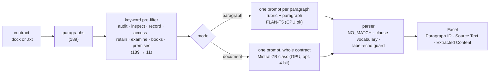

# Contract Clause Extraction: Audit & Inspection Rights

**Pull every "Audit & Inspection Rights" clause out of a contract with an open LLM, straight into Excel, with each hit traced back to its source paragraph. Measured on a public SEC-filed contract on a laptop CPU: 8 of 8 clauses found, 1 false positive.**

  [](https://github.com/gandhiashutosh14/contract-clause-extraction/actions/workflows/ci.yml) 

---

## What it is, and why

Legal review teams need to find every place a contract grants one party the right to audit the other: books-and-records access, premises inspection, record-retention duties, audit procedure rules. They also need to *not* pick up look-alikes: government audits, acceptance-testing inspections, the definition of "auditor".

This tool encodes that rubric, sends only the paragraphs that could plausibly match to a Hugging Face model, filters the model's answer, and writes an Excel sheet the reviewer can check line by line. It started as a hiring take-home with four separate scripts (FLAN-T5 per paragraph, Mistral-7B over the whole document, a 4-bit Mistral, a few-shot FLAN-T5 with a keyword gate). They are consolidated here into one CLI with two modes and a test suite.

## How it works



## Measured results

Public contract: a Strategic Alliance Agreement filed with the SEC as Exhibit 10.17 (see [`contracts/SOURCE.md`](contracts/SOURCE.md)). Its Article 9 (Records) and Article 10 (Audit of Records) contain 8 paragraphs that match the rubric. Windows 11 laptop, CPU only, 2026-09-16, `--mode paragraph`:

| Model | Load | Inference (11 paragraphs) | Extracted | Correct | Missed | False positives |
|---|---|---|---|---|---|---|
| `google/flan-t5-base` | 11 s (cached) | 8.7 s | 0 | 0 | 8 | 0 (it echoed the label "Audit and Inspection Rights" twice; the parser drops that) |
| `google/flan-t5-large` | 223 s (download + load) | 89 s | 9 | 8 | 0 | 1: the "Confidential Information" definition, which mentions access to documents |

The FLAN-T5-large output is committed as [`contracts/sample_output_flan_t5_large.xlsx`](contracts/sample_output_flan_t5_large.xlsx). Ground truth was judged against the rubric by the author of this README on this one contract, so treat the numbers as a sanity check, not a benchmark. The 7B causal path was not run when this table was produced (no GPU).

## Key features

- **Rubric as data**: the include and exclude lists are Python constants rendered into every prompt, so changing the target clause type is a text edit.
- **Cheap lexical gate before the model**: eight keywords cut 189 paragraphs to 11 model calls on the sample contract. The `--dry-run` flag shows exactly what would be sent.
- **Two extraction modes**: per-paragraph for small seq2seq models on CPU; whole-document with a sentinel line for instruction-tuned causal models.
- **Defensive output parsing**: `NO_MATCH` handling, a clause-vocabulary filter, and a guard for the label-echo failure mode observed with the base model.
- **Traceable output**: every row carries the 1-based paragraph number and the first 500 characters of the source paragraph, so a reviewer can verify without re-reading the contract.
- **Deterministic decoding** (beam search, no sampling) so runs are reproducible.

## Tech stack

Python 3.11 · `transformers` 5.x (works with 4.40+) · PyTorch · `python-docx` · pandas + openpyxl · pytest. Models: `google/flan-t5-base` / `-large` (seq2seq), `mistralai/Mistral-7B-Instruct-v0.2` or any instruction-tuned causal model, optionally 4-bit via `bitsandbytes`.

## AI engineering highlights

1. **Spend model calls only where they can matter.** The keyword gate is a 17x reduction on this contract, and because it runs before the model it is also the thing to tune first when recall is the problem.
2. **Separate the model from everything testable.** Reading, filtering, prompting, parsing and Excel writing are plain functions; the 12 tests drive the whole pipeline with a fake generator and finish in under a second, with no torch in CI.
3. **Parse for the failure you actually saw.** The base model did not hallucinate clauses; it echoed the label. The guard for that is a regex with a test that pins the observed output.
4. **Report what was measured, including the miss.** One false positive on a definition paragraph is in the table above rather than trimmed out.

## Quick start

```bash
git clone https://github.com/gandhiashutosh14/contract-clause-extraction.git
cd contract-clause-extraction
python -m venv .venv
# Windows: .venv\Scripts\activate    macOS/Linux: source .venv/bin/activate
pip install -r requirements-dev.txt          # installs torch; first run also downloads the model

pytest -q                                    # 12 passed, no model needed

# See what the pre-filter would send (no model needed)
python extract_clauses.py --input contracts/sample_contract.docx --dry-run

# Extract with FLAN-T5-large on CPU (about 2 minutes after the one-time download)
python extract_clauses.py --input contracts/sample_contract.docx --output out.xlsx --model google/flan-t5-large

# Whole-document mode with a 7B instruction model on a CUDA GPU (gated models: `huggingface-cli login`)
python extract_clauses.py --input contracts/sample_contract.docx --output out.xlsx --mode document --quantized
```

`--dry-run` output on the sample contract:

```
189 paragraphs, 11 pass the keyword pre-filter
  [11] "Confidential Information" means information, data, patents, documents, analyses, ...
  [54] Article 9: Records.
  [55] Consortium agrees to keep accurate written records sufficient in detail to enable ...
  [57] Article 10: Audit of Records.
  [58] Upon reasonable notice and during regular business hours, Consortium shall from time ...
  ...
```

## Project layout

```
extract_clauses.py          CLI: read → pre-filter → prompt → model → parse → Excel
contracts/
  sample_contract.docx/.txt public SEC-filed contract used for the measurements
  sample_output_flan_t5_large.xlsx   the committed run output
  SOURCE.md                 provenance of the sample
tests/test_extract_clauses.py       12 tests with a fake model
docs/DEVELOPMENT_NOTES.md   how this was built and refined
```

## Status and scope

Working prototype.

- Evaluated on one contract by one annotator; no held-out set, no inter-annotator agreement.
- The causal (Mistral-class) backend and the 4-bit path are implemented but were not run during the refinement (no GPU available). They mirror the original take-home scripts.
- Paragraph mode cannot join a clause that spans paragraphs; document mode can but depends on a larger model.
- Excel is the only output format because that was the required deliverable.

## License

MIT. See [LICENSE](LICENSE).
